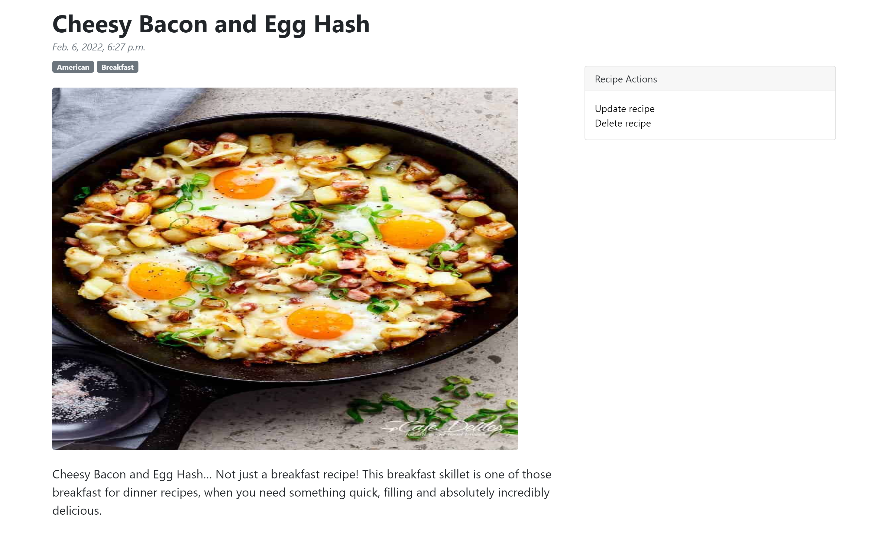

# Cookbook 

Cookbook is a full-stack web app that allows users to create, read, update, and delete recipe blog posts. I built a RESTful API that serves data to a multi-page front-end styled with Sass and Bootstrap. The back-end utilizes custom slug URLs, and Django serializers, models, filters, and forms.
## Tech Stack

**Client:** HTML, JavaScript, Sass, Bootstrap

**Server:** Django, REST API

## Features

- User authentication
- CRUD functionality
- REST API
- Slug URLs
- Django models, forms, and filters
- Pagination

## Screenshots

## Demo

https://hunterbury-cookbook.herokuapp.com/

